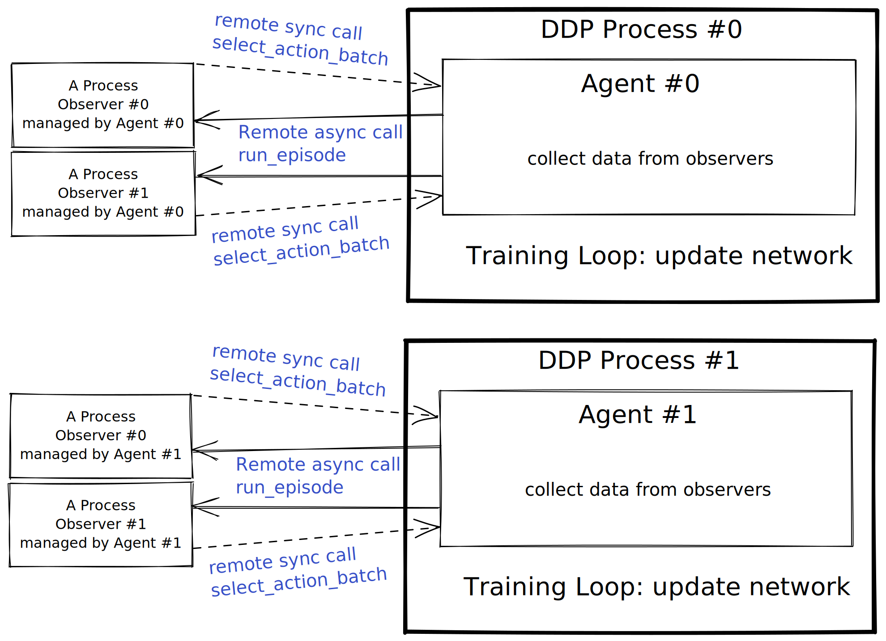

# PPO

## Implementation Details

We use PyTorch RPC and DDP to accelerate the training process.

The multi-processing model is designed as below.



The execuation flow can be summerized as follows.

```pseudocode
main:
    mp.spawn processes
    PPOMod.init_process
        There are 2 kinds of processes.
        ddp process:
            PPOMod.train
                init self.ac_net : ActorCritic
                init self.agent: Agent (each ddp process has an agent)
                Train loop:
                    PPOMod.train_iter
                        self.agent.collect_data
                            for each observer this agent manages:
                                select a graph_buffer according to self.init_buffer_turn in a Round-Robin way
                                init_graph = graph_buffer.sample()
                                remote async call: observer.run_episode , get a Future object
                            wait until all of the Future objects are ready (means all of the observers finish running an episode)
                                During waiting, Agent.select_action_batch may be called by its observers
                                    if there's a batch of observers waiting for actions:
                                        batch all of the current graphs of observers together
                                        inference by ac_net to compute action nodes and xfer distributions
                                        tell the observers that the results are ready
                            convert graph
                            maintain graph_buffer, best graph
                            batch data
                        update the network for K_epochs
        
        observer process:
            sleep if there's no call
            When called by the agent (which manages it) to execute Observer.run_episode:
                for each step in an episode:
                    remote sync call: Agent.select_action_batch to get action's node and xfer's distribution (wo mask)
                    generate xfer mask and sample a xfer to get the complete action
                    apply action
                    save experience
                return experiences
```
